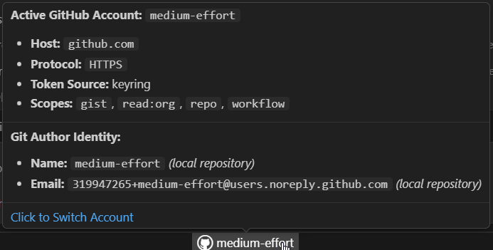
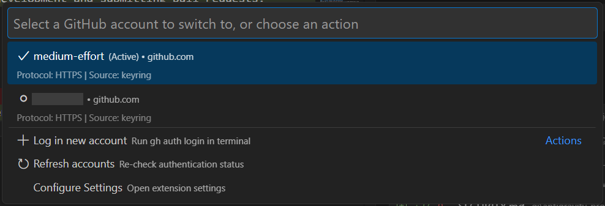

<div align="center">


# GitHub Account Switcher for VS Code

[](https://github.com/medium-effort/vscode-github-account-switcher/actions/workflows/ci.yml)
<!-- [](https://open-vsx.org/extension/medium-effort/github-account-switcher) -->
[](https://marketplace.visualstudio.com/items?itemName=medium-effort.github-account-switcher)
[](LICENSE)

**A lightweight, responsive VS Code extension that displays your active GitHub account in the Status Bar and allows you to quickly switch between multiple accounts and sync local Git identities using the official GitHub CLI (`gh`).**

</div>

---

## 🚀 How to Use

### 1. Status Bar Item & Rich Tooltip
Once activated, you will see a GitHub icon and your active username in the status bar. Hover over it to see authentication details, active scopes, and the current workspace's Git author identity:

<div align="center">
  
</div>

<br/>

### 2. Switching Accounts
1. Click the status bar item (or press `Ctrl+Shift+P` / `Cmd+Shift+P` and run **`GitHub Account Switcher: Switch GitHub Account`**).
2. Select the desired account from the QuickPick menu:

<div align="center">
  
</div>

<br/>

3. The extension runs `gh auth switch --user <username>`, automatically synchronizes your repository `git config` (`user.name` and `user.email`), and updates the status bar immediately.

### 3. Adding New Accounts
Select **`$(add) Log in new account`** from the QuickPick menu to launch an interactive `gh auth login` terminal session.

---

## ✨ Features

- **⚡ Real-Time Active Account in Status Bar**: Always know which GitHub account is currently active (`$(github) octocat`).
- **🔄 One-Click Quick Switcher**: Click the status bar item or open the Command Palette to view all logged-in accounts and switch instantly.
- **🎯 Workspace Identity Auto-Detection**: When opening an existing repository, the extension inspects local Git configuration (`user.email`, `user.name`, or remote URL) and automatically switches the active GitHub account to match.
- **✨ Auto-Configure on `git init`**: When initializing a new repository (`git init`), the extension automatically configures local Git identity (`user.name` and `user.email`) using the currently active GitHub account.
- **📁 Automatic Git Config Synchronization**: When switching accounts, automatically updates your repository's local (or global) `git config user.name` and `user.email` to match the selected GitHub account.
- **🏢 Enterprise & Multi-Host Support**: Supports accounts across both `github.com` and custom GitHub Enterprise servers.
- **ℹ️ Rich Status Tooltip**: Hover over the status bar item to view details such as active host, Git protocol (SSH / HTTPS), token source, OAuth scopes, and the **current workspace's active Git author name & email** (clearly indicating whether it is `local` or `global fallback`).
- **🔑 Integrated Login**: Trigger `gh auth login` directly inside an integrated VS Code terminal to add new accounts.
- **👁️ Auto-Sync & Focus Refresh**: Automatically updates when you switch back to VS Code after modifying accounts in an external terminal.

---

## 📦 Installation

### 1. Visual Studio Code Marketplace
Search for **`GitHub Account Switcher`** in the Extensions view (`Ctrl+Shift+X` / `Cmd+Shift+X`) and click **Install**.

<!--
### 2. Open VSX Registry (VSCodium, Gitpod, Eclipse Theia)
Install directly from [Open VSX](https://open-vsx.org/extension/medium-effort/github-account-switcher) or via command line:
```bash
ovsx install medium-effort.github-account-switcher
```
-->

### 2. Manual VSIX Installation
Download the latest `github-account-switcher-x.x.x.vsix` from [GitHub Releases](https://github.com/medium-effort/vscode-github-account-switcher/releases) and run:
```bash
code --install-extension github-account-switcher-0.1.5.vsix
```

---

## 📋 Prerequisites

This extension leverages the official **GitHub CLI** (`gh`) to manage credentials and execute account switches securely.

1. Ensure the [GitHub CLI](https://cli.github.com/) is installed on your system (`gh --version`).
2. Authenticate your accounts via terminal:
   ```bash
   gh auth login
   ```

---

## ⚙️ Configuration Settings

Customize behavior in VS Code **Settings** (`Ctrl+,` / `Cmd+,` searching for `GitHub Account Switcher`):

| Setting | Default | Description |
| :--- | :--- | :--- |
| `githubAccountSwitcher.autoSwitchOnWorkspaceOpen` | `true` | Automatically detect local repo git identity and switch to matching GitHub account on workspace open. |
| `githubAccountSwitcher.autoSwitchOnWindowFocus` | `true` | Automatically detect local repository git identity and switch when returning/focusing this VS Code window. |
| `githubAccountSwitcher.syncGitConfig` | `"local"` | Synchronize `git config` on switch (`"local"` updates repo config, `"global"` updates global config, `"off"` disables). |
| `githubAccountSwitcher.refreshInterval` | `60` | Auto-refresh interval in seconds (`0` to disable background polling). |
| `githubAccountSwitcher.statusBarAlignment` | `"right"` | Alignment of the status bar item (`"left"` or `"right"`). |
| `githubAccountSwitcher.statusBarPriority` | `100` | Priority order in the status bar (higher numbers appear further left). |
| `githubAccountSwitcher.showHost` | `true` | Show host domain prefix for non-github.com accounts (e.g. `ghe.corp:username`). |
| `githubAccountSwitcher.ghPath` | `"gh"` | Custom path to the GitHub CLI binary if not in your system `PATH`. |

---

## ⌨️ Extension Commands

| Command | Title | Description |
| :--- | :--- | :--- |
| `github-account-switcher.switchAccount` | Switch GitHub Account | Opens the account picker menu. |
| `github-account-switcher.refresh` | Refresh Accounts | Re-queries `gh auth status` immediately. |
| `github-account-switcher.login` | Log In New Account | Opens terminal to run `gh auth login`. |

---

## 🤝 Contributing

Contributions, issues, and feature requests are welcome!
Please read our [Contributing Guide](CONTRIBUTING.md) to get started with local development and submitting pull requests.

---

## 📄 License

This project is licensed under the [MIT License](LICENSE).
